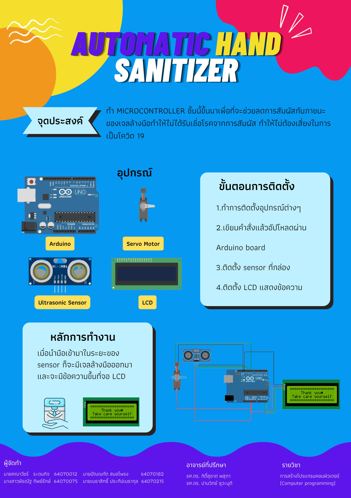

# AUTOMATIC HAND SANITIZER
> Project Computer Programming IT KMITL 2/2021
# ที่มา
  > การระบาดใหญ่ของโควิด 19 ส่งผลกระทบต่อชีวิตมนุษย์ทั่วโลก หน่วยงานที่เกี่ยวข้องมีความพยายามหลากหลายอย่างในการลดการแพร่กระจายของไวรัสโดยการให้ทำงานจากที่บ้าน การเว้นระยะห่างทางสังคม และรวมถึงสุขอนามัยของมือเพราะเชื้อโรคสามารถติดได้จากการสัมผัส การใช้เจลล้างมือถือเป็นการลดเชื้อโรค แต่การใช้เจลจำเป็นต้องสัมผัสที่ภาชนะของเจลล้างมือ ดังนั้นการใช้ Microcontroller ในรูปแบบเซ็นเซอร์จะช่วยลดการสัมผัสกับภาชนะของเจลล้างมือทำให้ไม่ได้รับเชื่อโรคจากการสัมผัส ทำให้ไม่ต้องเสี่ยงในการเป็นโควิด 19
# วัตถุประสงค์
> เพื่อป้องกันการแพร่กระจายของการติดเชื้อโดยใช้ Microcontroller มากดภาชนะเจลล้างมืออัตโนมัติ ทำให้สามารถล้างมือได้โดยไม่ต้องสัมผัส
# ประโยชน์ที่ได้รับ
> * ลดการแพร่กระจายของเชื้อโรค
> * เป็นทางเลือกในการทำความสะอาดมือที่ให้ความสะดวก
# อุปกรณ์
> * Arduino Uno R3
> * Ultrasonic Distance Sensor
> * Servo Motor
> * Lcd 20x4 I2C
# เว็บที่ใช้เขียนโค้ด
> [WOKWI](https://wokwi.com/projects/330176541007807060)
# วิดีโอนำเสนอ
> [AUTOMATIC HAND SANITIZER | IT KMITL Computer Programming Project 2022](https://youtu.be/MZYNmv7S1OY)
# โปสเตอร์
>  
### สมาชิก
---

| รหัสนักศึกษา | ชื่อ - นามสกุล |  หน้าที่ |
| :-------- | :-------- | :--------- |
|   64070012   |   คณาวัชร์ ระดมกิจ   |    Poster / Abstract   |
|   64070075   |   พีรณัฐ ทิพย์รักษ์   |    Poster / Abstract   |
|   64070182   |   ปัณณทัต สมอโพรงำ   |    Video / Microcontroller   |
|   64070215   |   เมธาสิทธิ์ ประทีปเมธากุล   |    Github / Microcontroller   |
